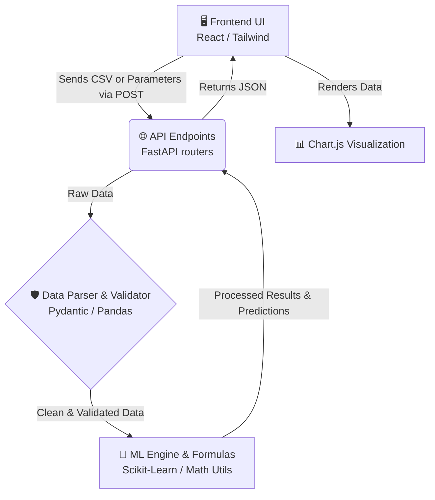

# 🚀 Hysteresis Loss Simulation - Developer Guide

Welcome to the Hysteresis Loss Simulation project! Whether you're working on the Data Engine, ML Engine, API Endpoints, or Frontend UI, this guide will give you a clear, high-level map of our application's structure. We've built a robust system, and this document will help you understand exactly how your piece fits into the bigger picture.

Let's build something awesome! 💡

---

## 🏗️ 1. Architecture Blueprint: How Data Flows

Understanding the data journey is the key to our application. Here is the high-level path a piece of data (like an uploaded CSV or a form parameter) takes through our system:



**The Step-by-Step Flow:**
1. **Frontend (UI):** The user interacts with the Tailwind-styled interface and uploads a CSV or tweaks parameters.
2. **API Router:** FastAPI receives this data.
3. **Validation & Cleaning:** Pydantic schemas ensure the data is strictly typed, while Pandas cleans up any messy CSV inputs.
4. **Math & ML:** The data is passed into our Scikit-Learn pipelines and physics formulas (Steinmetz, Bertotti) to calculate the hysteresis loss.
5. **Visualization:** The computed data is returned as clean JSON to the frontend, where Chart.js plots the final beautiful curves.

---

## 📂 2. File Responsibilities Breakdown

To keep our teams aligned, here is exactly what our core backend files do and who owns them:

### `backend/app/utils/formulas.py`
* **What it does:** This is the core physics engine. It houses the pure mathematical implementations of the Steinmetz equation, Bertotti's loss separation model, and Menger Curvature calculations. If it involves electromagnetic math, it lives here.
* **Team Ownership:** 🧠 **ML Engine Team**

### `backend/app/utils/data_parser.py`
* **What it does:** The bouncer of our club. It contains Pydantic data schemas to strictly validate incoming requests, and Pandas utility functions to clean, normalize, and parse uploaded CSV datasets before they hit the ML models.
* **Team Ownership:** 🧹 **Data Engine Team**

### `backend/app/models/hysteresis_model.py`
* **What it does:** The brain of the operation. This file wraps our Scikit-Learn pipelines. It handles the log-linear Ridge Regression for Steinmetz parameter estimation and uses the Curve Analyser to predict and generate the B-H curve data points.
* **Team Ownership:** 🤖 **ML Engine Team**

### `backend/app/api/routes.py`
* **What it does:** The traffic controller. It defines the FastAPI POST/GET endpoints. It receives requests from the frontend, delegates the workload to the parsers and models, and packages the results back into JSON responses.
* **Team Ownership:** 🔌 **API Endpoints Team**

---

## 🌿 3. Branching Strategy & Testing Guide

To make sure we don't step on each other's toes and keep the `main` branch stable, please follow this quick 3-step checklist for every new feature or bug fix:

### Step 1: Check Out Your Feature Branch
Always branch off the latest `main`. Use a descriptive name including your team prefix (e.g., `ml-`, `api-`, `ui-`, `data-`).
```bash
git checkout main
git pull origin main
git checkout -b feature/your-team-prefix/awesome-new-feature
```

### Step 2: Run the Lock Checker
Before making changes, ensure you aren't modifying files currently locked by another team member. Run our custom lock script:
```bash
python check_locks.py
```
*(If it gives you the green light, you're good to code!)*

### Step 3: Spin Up the Server Locally
Test your changes locally before opening a Pull Request. Start the FastAPI server using Uvicorn:
```bash
cd backend
uvicorn app.main:app --reload
```
Your local API will now be running at `http://127.0.0.1:8000`. You can test your endpoints interactively at `http://127.0.0.1:8000/docs`.

---
*If you have any questions, don't hesitate to reach out in the team channel. Happy coding!* 🚀
